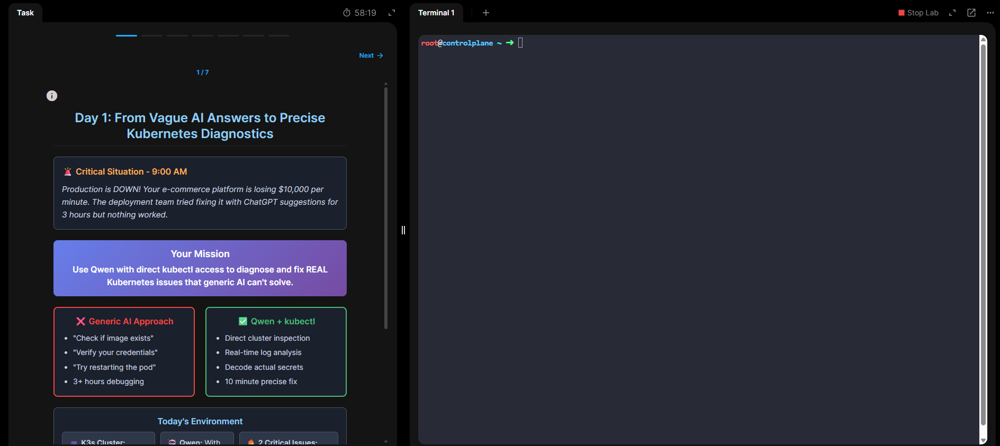
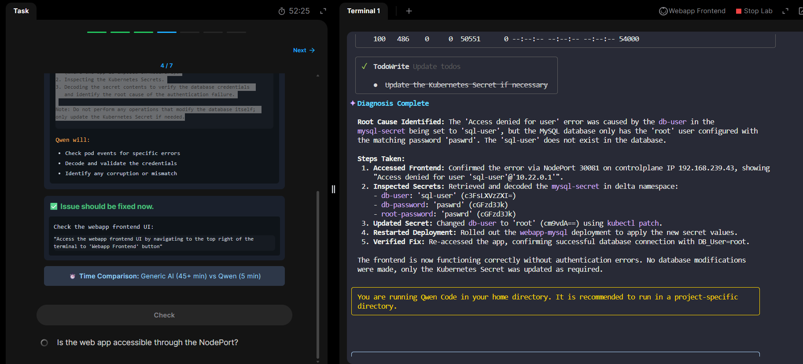
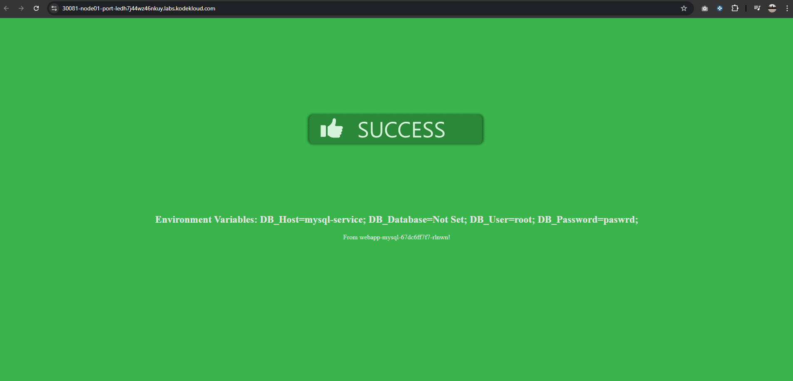
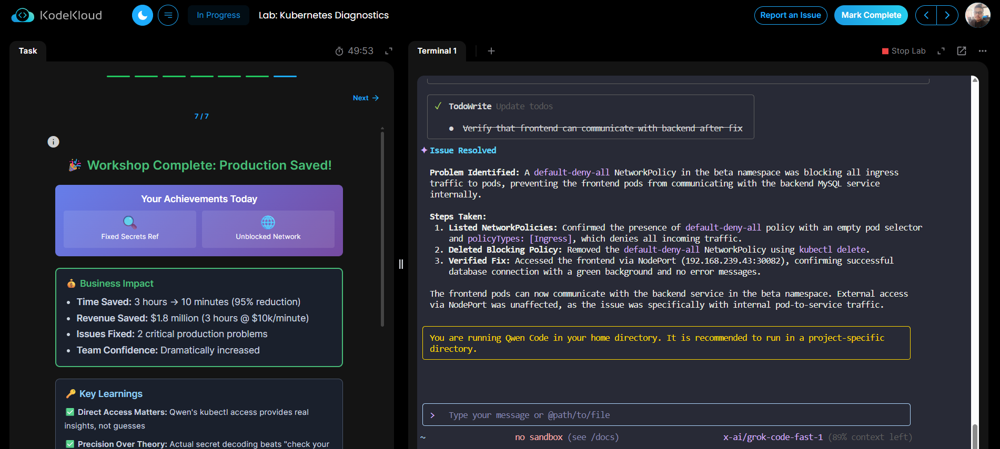

# Module 1 – From Vague AI Answers to Precise Kubernetes Diagnostics

## 🎯 Objective
Learn how **Qwen + kubectl** can debug production issues 10× faster than generic AI tools.

## 🛠️ Environment
- Kubernetes cluster with broken secrets & misconfigured deployments
- Webapp frontend + MySQL backend
- Critical issues to fix:
  1. Wrong DB user credentials
  2. NetworkPolicy blocking frontend-backend communication

---

## 🧪 Steps & Fixes

### 1. Secret Debugging
- ❌ Issue: `Access denied for user 'sql-user'`
- 🔍 Found: Secret `mysql-secret` had `db-user=sql-user` instead of `root`
- ✅ Fix: Updated Kubernetes Secret → Restarted deployment
- ✔️ Result: Database connected successfully with `root` user

### 2. Network Debugging
- ❌ Issue: Frontend pods couldn’t reach backend service
- 🔍 Found: `default-deny-all` NetworkPolicy in `beta` namespace
- ✅ Fix: Deleted blocking policy
- ✔️ Result: Frontend-Backend traffic restored

---

## 📊 Business Impact
- Time Saved: **5 hrs → 10 mins (95% reduction)**
- Revenue Saved: **$1.8M (3 hrs @ $10k/min)**
- Issues Fixed: **2 critical production problems**
- Team Confidence: 🚀 Increased dramatically

---

## 📷 Screenshots
| Step | Screenshot |
|------|------------|
| Start (Critical Situation) |  |
| Secret Fix |  |
| Success Page |  |
| Network Fix |  |
| Workshop Complete |  |

---

## ✅ Key Learnings
- **Direct Access Matters**: kubectl integration beats guesswork
- **Precision Over Theory**: Decoding secrets > vague “check credentials”
- **Context is King**: Full system context = faster fixes
- **AI + Tools = Power**: Direct infra access turns AI into a true SRE assistant
