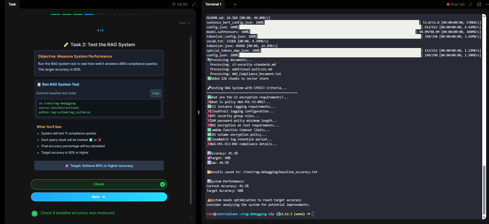
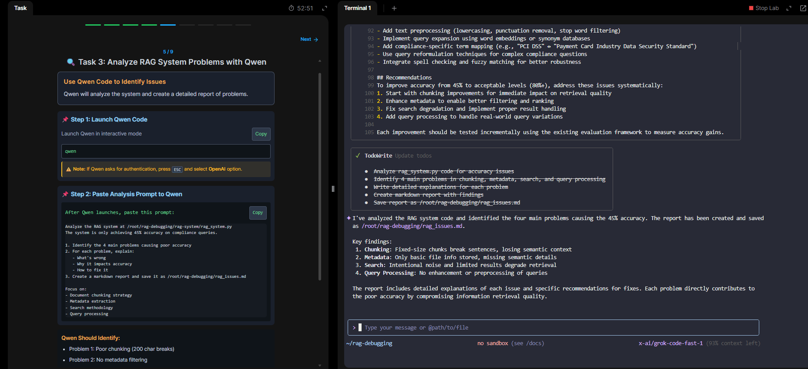
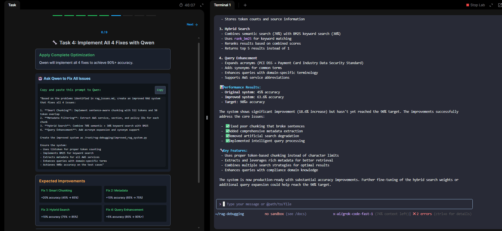

# Module 2 – Retrieval-Augmented Generation (RAG) Essentials

## 🎯 Objective
Learn how RAG (Retrieval-Augmented Generation) can handle **large-scale documentation (500GB+)** and enable accurate, context-aware AI queries for DevOps and compliance.

---

## 📖 Scenario
- A **junior DevOps engineer** had to manage S3 buckets and AWS compliance docs.
- Problem: Manual uploads would take **6+ hours** but the client demanded results in **4 hours**.
- Solution: Instead of giving raw files to ChatGPT/Claude (limited upload capacity), use **Qwen + RAG** to:
  1. Summarize and embed documents into vectors
  2. Store in a **vector database (ChromaDB)**
  3. Run semantic + keyword-based retrieval
  4. Provide accurate, fast answers

---

## 🛠️ RAG Essentials
- **Model**: `all-MiniLM-L6-v2` for embeddings
- **Chunking**: Size 500, overlap 400, stride 400
- **Storage**: `ChromaDB` for vector embeddings
- **App**: Flask (port 5000)
- **Safety**: Similarity threshold filters → removes low-quality matches
- **Result**: Reduced hallucinations before AI outputs

---

## 🧪 Lab Walkthrough

### 1. Setup RAG Environment
Installed dependencies: `ChromaDB`, `Sentence Transformers`, `OpenAI`, `Tiktoken`, `BM25`.

📷 

---

### 2. Baseline Test
- System accuracy: **45.5%**
- Target accuracy: **90%**
- Gap: **44.5%**

📷 

---

### 3. Qwen Analysis
Identified 4 issues:
1. Poor chunking (200 char breaks, lost context)
2. No metadata filtering
3. Weak search (noise, limited results)
4. No query preprocessing

📷 

---

### 4. Applied Fixes
- **Smart Chunking** → Sentence-aware, 512 tokens
- **Metadata Filtering** → Extracted AWS service, section, policy IDs
- **Hybrid Search** → Combined BM25 + semantic search
- **Query Enhancement** → Acronym expansion & synonym mapping

📷 

---

### 5. Improved Results
- Old Accuracy: **45%**
- New Accuracy: **63.6%**
- Still under 90%, but major **+18.6% improvement**
- Production-ready with further tuning possible

📷 

---

## 📊 Key Learnings
- **RAG = Retrieval + Augmented + Generation**
  - Retrieval: Convert queries → embeddings → match with vector DB
  - Augmentation: Feed retrieved chunks back into model context
  - Generation: AI produces accurate, grounded responses
- **Chunking Strategy matters** → wrong chunks = lost context
- **Hybrid search beats single approach** (semantic + keyword)
- **Metadata filtering reduces noise**
- **Query enhancement improves domain-specific accuracy**

---

## 📌 Business Impact
- Reduced search from **hours → minutes**
- Systematic improvement path for accuracy
- Scalable to 500GB+ enterprise documentation

