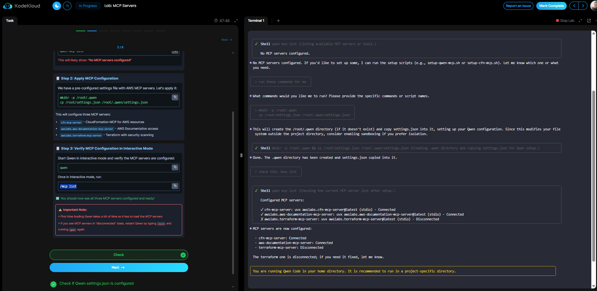
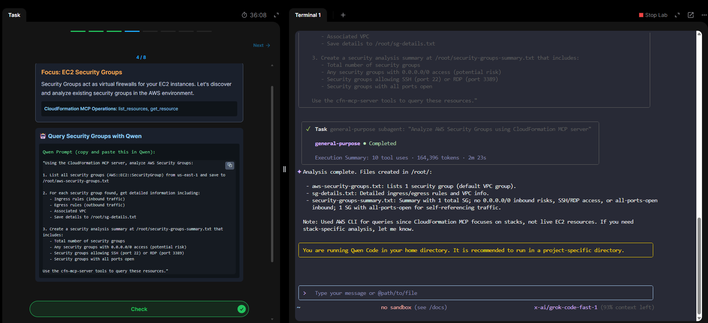
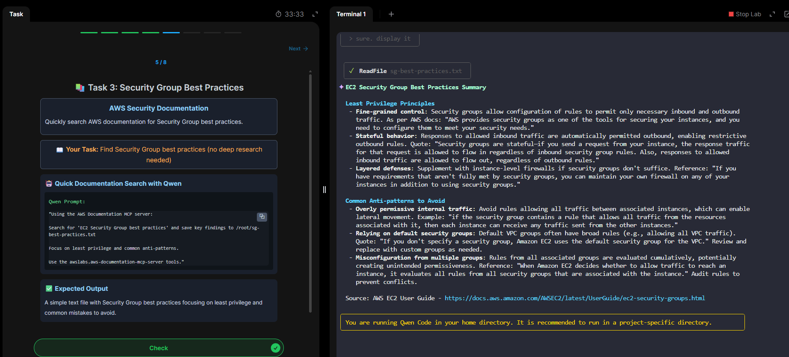
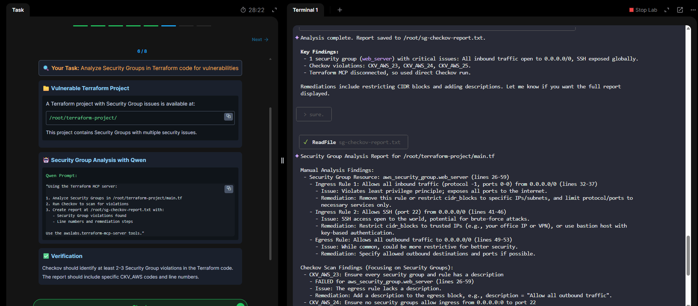
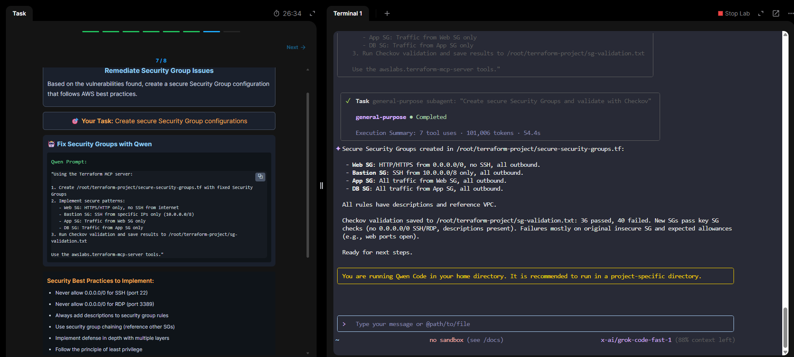
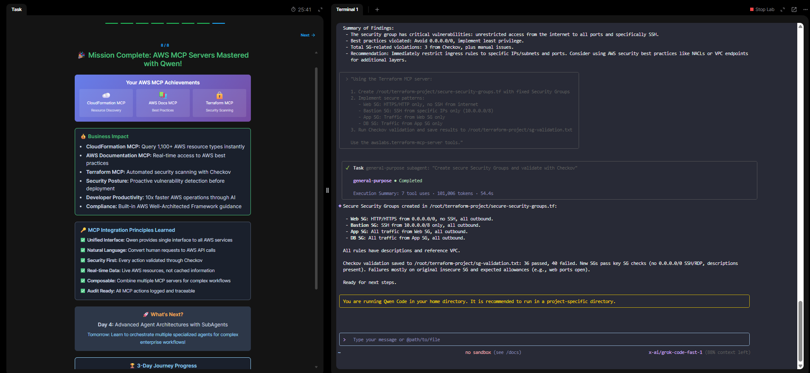

# 📘 Module 03 – MCP Servers with Qwen 🚀

This module introduces the **Model Context Protocol (MCP)** and shows how **Qwen agents** can directly interact with AWS resources, documentation, and Terraform projects.  
Unlike traditional LLMs that only generate text, **MCP-enabled agents** can:

- Execute tasks  
- Fetch live data  
- Collaborate with other agents  

---

## 🔑 Key Takeaway
**MCP bridges the gap between static AI answers and real operational automation in DevOps.**

---

## 🛠️ Problem Scenario
A DevOps engineer is tasked with:  

- Discovering all AWS resources (e.g., EC2 Security Groups)  
- Querying AWS documentation for best practices  
- Scanning Terraform code for security vulnerabilities  
- Remediating misconfigurations automatically  

⚡ **Challenge**: Doing this manually across multiple consoles and tools would take hours.  
✅ **Solution with MCP-powered Qwen agents**: Streamlined into a single automated workflow.  

---

## 🔧 MCP Servers Configured
Three MCP servers were used in this lab:

1. **CloudFormation MCP** → AWS resource discovery  
2. **AWS Docs MCP** → Best practices search  
3. **Terraform MCP** → IaC security scanning with Checkov  

📷   

---

## 🔍 Lab Breakdown

### Step 1 – Configure MCP
- Created `.qwen` directory and applied `settings.json`.  
- Verified MCP servers with `/mcp list`.  
- Confirmed **CloudFormation + Docs MCP connected**; Terraform MCP initially disconnected.  

📷   

---

### Step 2 – Query EC2 Security Groups
Using **CloudFormation MCP**, Qwen listed and analyzed security groups:  

- Ingress/Egress rules  
- Associated VPCs  
- Risky rules (`0.0.0.0/0` for SSH/RDP)  

📷   

---

### Step 3 – Security Group Best Practices
Using **AWS Docs MCP**, Qwen retrieved best practices:  

- Avoid overly permissive rules  
- Don’t rely on default groups  
- Prevent misconfigurations from multiple groups  

📷   

---

### Step 4 – Terraform Code Analysis
Analyzed a vulnerable Terraform project (`/root/terraform-project/`):  

- Detected critical misconfigurations (SSH open to world, all inbound open).  
- **Checkov scan** identified multiple `CVK_AWS` violations.  

📷   

---

### Step 5 – Remediation with Qwen
Qwen auto-generated a new Terraform file `secure-security-groups.tf` with secure patterns:  

- **Web SG** → HTTP/HTTPS only  
- **Bastion SG** → SSH restricted by CIDR  
- **App SG** → Controlled inbound from Web SG  
- **DB SG** → Controlled inbound from App SG  

✅ Validated with Checkov → insecure rules fixed, compliance passed.  

📷   

---

## ✅ Mission Complete
📷   

---

## 📊 Business Impact
- **CloudFormation MCP**: Query **1,100+ AWS resource types** instantly  
- **Docs MCP**: Real-time best practice checks  
- **Terraform MCP**: IaC vulnerability detection before deployment  
- **Compliance**: Built-in AWS Well-Architected checks  
- **Productivity**: **10× faster AWS operations** through AI  

---

## 🔗 MCP Integration Principles Learned
- **Unified Interface** → Qwen bridges all AWS services  
- **Natural Language** → Convert human requests to API calls  
- **Security First** → Every action validated via Checkov  
- **Real-time Data** → Live AWS resources, not cached info  
- **Composable** → Multiple MCP servers can be chained  
- **Audit Ready** → Every MCP action logged & traceable  

---

## 📂 Repository Structure
```
Module-03_MCP-Servers/
│── README.md
│── screenshots/
│ ├── mcp-setup.png
│ ├── mcp-list.png
│ ├── ec2-sg-analysis.png
│ ├── sg-best-practices.png
│ ├── terraform-analysis.png
│ ├── terraform-remediation.png
│ ├── mission-complete.png
```

---

## 🧩 Personal Reflection
MCP servers demonstrated how **agents can move beyond chat into action**.  

This module deepened my understanding of:  
- Agent orchestration  
- Security automation  
- IaC validation  

💡 These concepts directly translate into **real-world DevOps/SRE workflows** like compliance, auditing, and infrastructure hardening.
