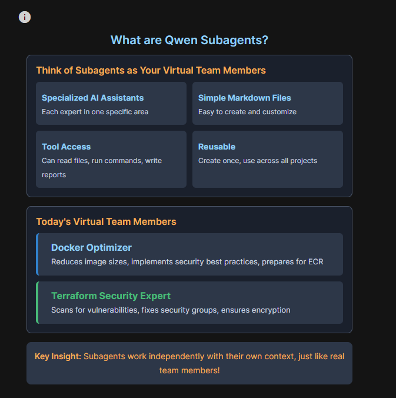
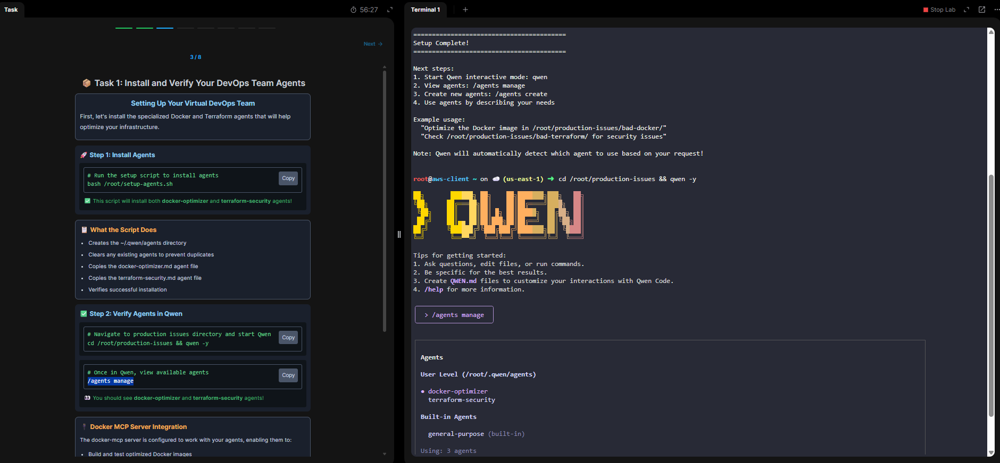
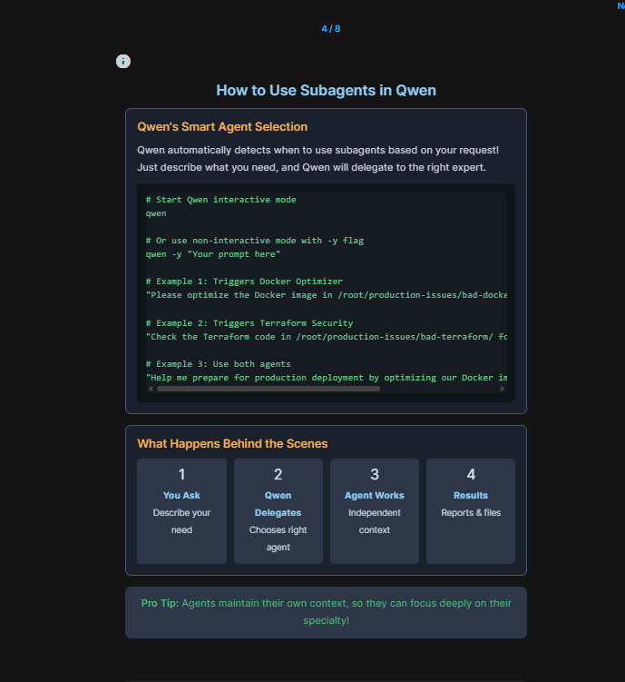
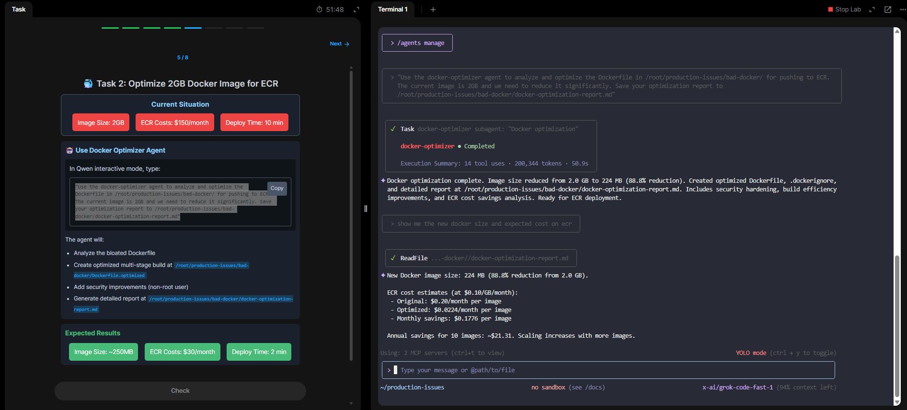
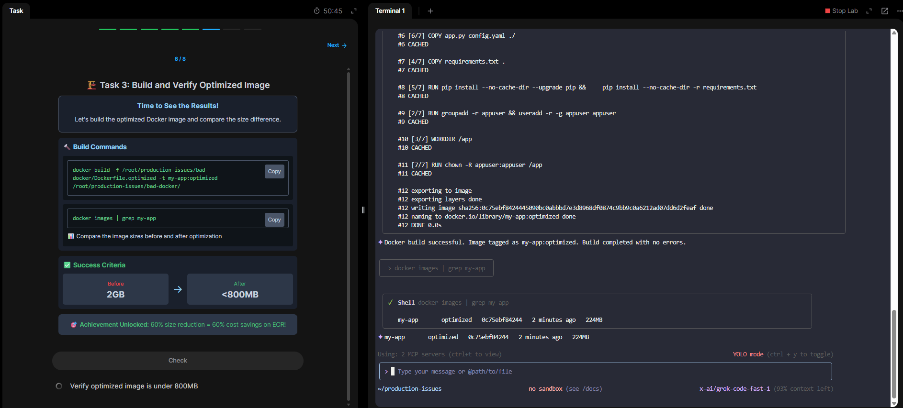
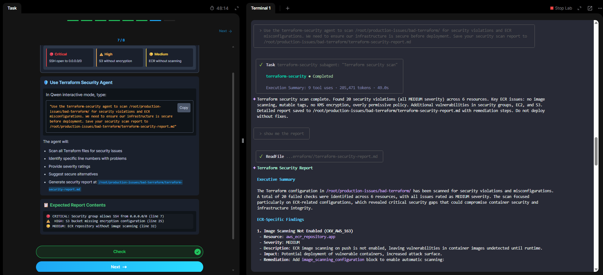

## Module 04 – Qwen AI Agents 🚀

###📌 Overview

- This module explored Qwen AI Agents and Subagents, which act like specialized teammates in a DevOps environment.
- Each subagent focuses on a specific domain (e.g., Docker optimization or Terraform security), helping automate infrastructure tasks with accuracy, speed, and security.
- Unlike a single monolithic model, Qwen orchestrates multiple agents:
	- Each with independent context
	- Each with specific tools
	- Each reusable across projects

👉 **Key Insight:** AI Subagents = Virtual teammates you can assign to tasks like Docker hardening, IaC scanning, and cost optimization.

📷 
---

## 🔑 Key Concepts

### What Are AI Subagents?

- Specialized AI Assistants → Experts in one specific area.
- Tool Access → Can read files, run commands, and generate reports.
- Reusable → Once created, can be reused across all projects.
- Independent Context → Work separately, like real team members.

---

## ⚙️ Lab Walkthrough

#### Step 1: Install & Verify Agents

- Installed two subagents using a setup script:
- Docker Optimizer → Reduces image size, implements best practices, prepares for ECR.
- Terraform Security Expert → Scans IaC for vulnerabilities, enforces encryption & SG security.
```
bash /root/setup-agents.sh
cd /root/production-issues && qwen -y /agents manage
```
- ✅ Agents successfully installed & listed.

📷

---

#### Step 2: Smart Agent Selection

- Qwen automatically delegates tasks to the right agent:
- Docker Example
```
qwen -y "Optimize the Docker image in /root/production-issues/bad-docker/"
```
- Terraform Example
```
qwen -y "Check Terraform in /root/production-issues/bad-terraform/ for security issues"
```

📷

---

#### Step 3: Optimize a 2GB Docker Image

- Current size: 2GB
- Optimized size: 224MB (88.8% reduction 🎉)
- ✅ Achievements:
	- Multi-stage Dockerfile
	- Added .dockerignore
	- Security improvements (non-root user)
	- Direct ECR cost savings

📷

---

#### Step 4: Build & Verify Optimized Image
```bash
docker build -f Dockerfile.optimized -t my-app:optimized ./bad-docker
docker images | grep my-app
```
- ✅ Success → 224MB image size

📷

---

#### Step 5: Terraform Security Scan

- Findings: 20 security issues (all Medium severity)
- Problems included:
	- SSH open to 0.0.0.0/0
	- Missing KMS encryption
	- No ECR image scanning enabled

📷

- 📑 Report saved: reports/terraform-security-report.md

---

#### Step 6: Mission Complete 🎯

- ✅ Final Achievements:
	- Created 2 Expert Agents (Docker + Terraform).
	- Reduced image size by ~89% (2GB → 224MB).
	- Identified critical Terraform vulnerabilities before deployment.
	- Automated expertise reusable across projects.

- 💡 Real-World Impact:
	- 💵 ~$1,440 annual ECR savings
	- ⚡ 5× faster deployments
	- 🔐 100% IaC security coverage

📷

---

## 📂 Repository Structure
```
Module-04_AI-Agents/
├── README.md
├── screenshots/
│   ├── 01-subagents-overview.png
│   ├── 02-install-verify-agents.png
│   ├── 03-smart-selection.png
│   ├── 04-docker-optimization.png
│   ├── 05-docker-build-verify.png
│   ├── 06-terraform-security-scan.png
│   └── 07-mission-complete.png
└── reports/
    └── terraform-security-report.md
```
