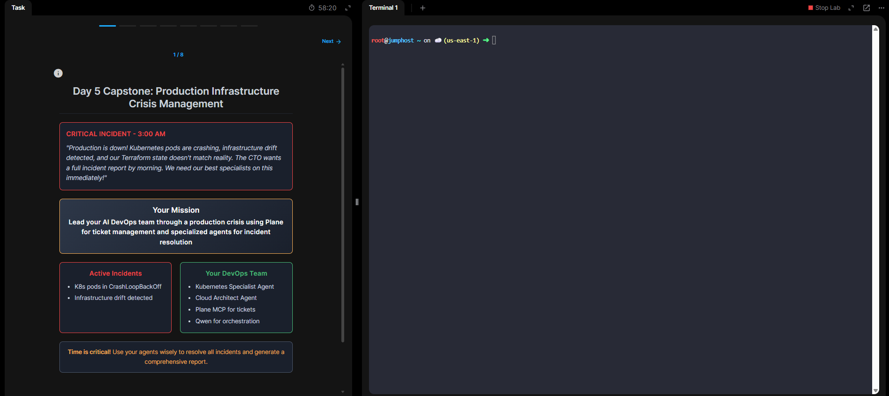
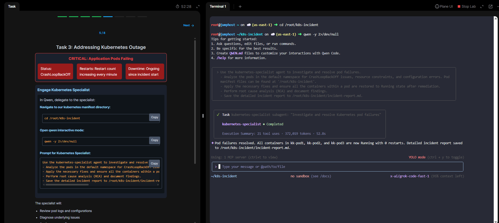
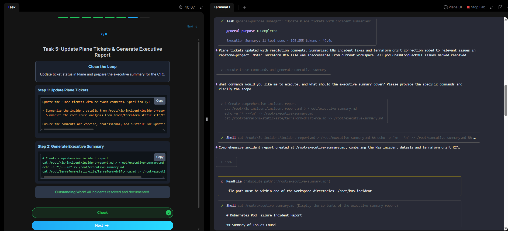
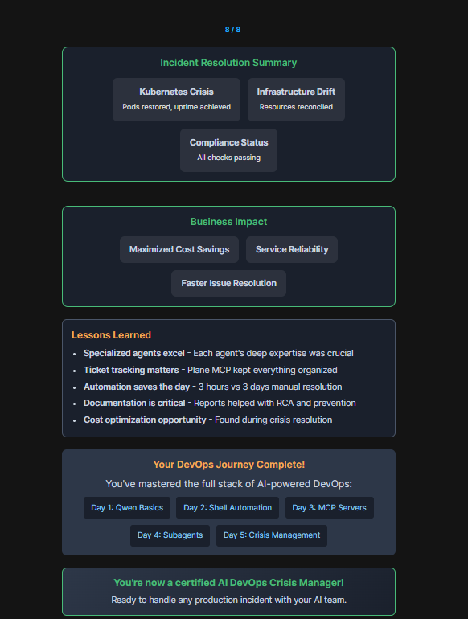

# 📘 Module 05 – Crisis Management (Capstone) 🚨  

## 📌 Overview  
This module simulated a **real-world production crisis at 3AM**:  
- Kubernetes pods in **CrashLoopBackOff**  
- **Infrastructure drift** between Terraform state & actual resources  
- A CTO demanding a **full incident report by morning**  

👉 **Your mission:** Lead an AI-powered DevOps team with Qwen + specialized agents to restore services, fix drift, update tickets, and generate an executive report.  

  

---

## 🔑 Key Concepts Learned  
- **Crisis Simulation** → Handling multiple incidents under time pressure  
- **AI Agents in Action** → Kubernetes Specialist, Cloud Architect, Plane MCP, Qwen Orchestrator  
- **Incident Lifecycle** → Detection → RCA → Fix → Validation → Documentation  
- **Plane MCP** → Centralized ticket management for updates and reporting  
- **Automation vs Manual** → 3 hours vs 3 days manual resolution  

---

## 🛠️ Lab Walkthrough  

### 1. Engage Kubernetes Specialist – Fix CrashLoopBackOff  
- Delegated to the **Kubernetes Specialist Agent**  
- Reviewed logs, diagnosed pod failures  
- Applied fixes & restored all pods  
- Generated incident report  

  
  

---

### 2. Resolve Infrastructure Drift with Cloud Architect Agent  
- Detected unmanaged **S3 resource** (missing `error.html`)  
- Used **Cloud Architect Agent** to reconcile drift  
- `terraform apply` → state & infra synced  
- Generated **RCA report**  

  

---

### 3. Update Plane Tickets & Generate Executive Report  
- Updated **Plane tickets** with concise RCA summaries  
- Combined incident reports into **Executive Summary** for CTO  
- Closed the loop with full documentation  

  

---

### 4. Mission Complete – Business Impact  
- **Kubernetes Crisis resolved** → pods stable  
- **Infra Drift fixed** → Terraform in sync  
- **Compliance** → All checks passing  

✅ **Business Benefits:** Faster recovery, cost savings, service reliability  

  

---

## 📊 Reports Generated  
- `reports/incident-report.md` → Kubernetes pod failure RCA  
- `reports/terraform-drift-rca.md` → Infrastructure drift analysis  
- `reports/executive-summary.md` → Combined report for CTO  

---

## 📈 Business Impact  
- ⏱️ **Time saved:** 3 hrs vs 3 days manual  
- 🛡️ **Reliability:** Reduced downtime, faster RCA  
- 💰 **Cost Optimization:** Identified efficiency opportunities  
- 📋 **Compliance:** Audit-ready documentation  

---

## 🧠 Lessons Learned  
- Specialized AI agents = **deep expertise** in specific domains  
- **Ticket tracking (Plane MCP)** is critical under stress  
- **Automation saves the day** → faster + more accurate than manual fixes  
- **Documentation is critical** for RCA and future prevention  
- **AI = not a replacement, but a force multiplier for DevOps**  
